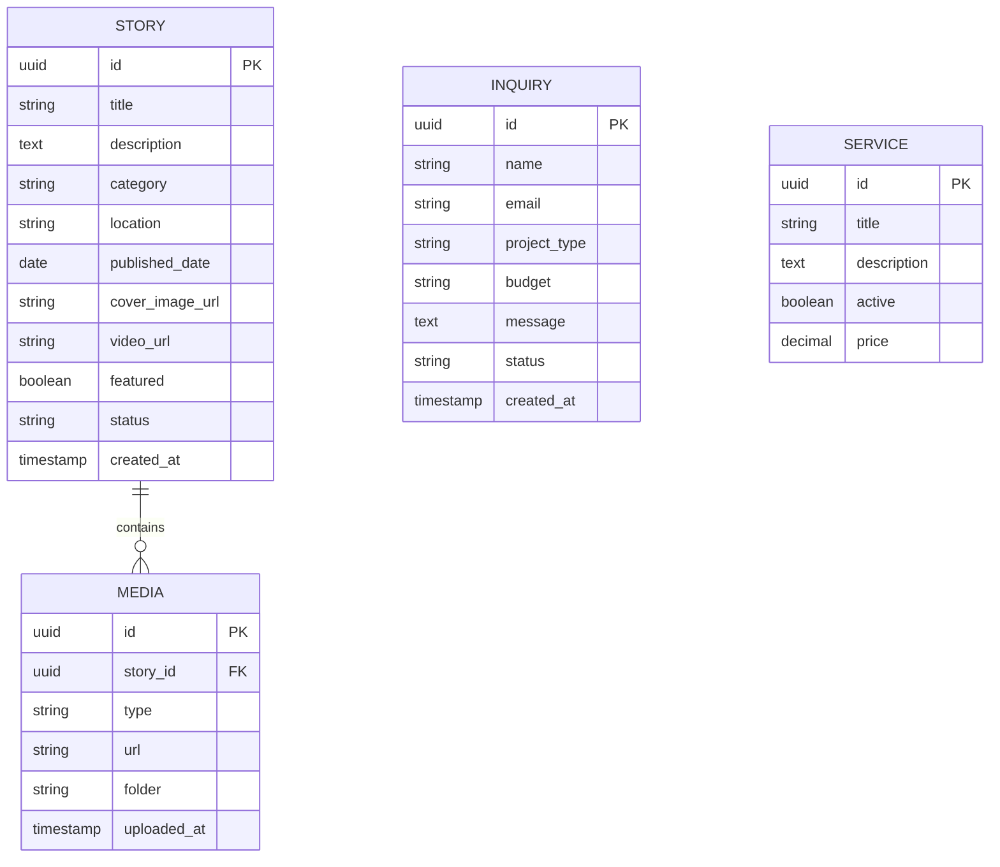

# Database Schema (Relational)

This document maps out the backend data models required for the CBCODER CMS ecosystem.

## REST API Endpoints

### Public Endpoints (Frontend Use)
- `GET /api/v1/stories`: Retrieve paginated listed of published stories.
- `GET /api/v1/stories/:id`: Retrieve single story with associated media.
- `GET /api/v1/services`: Retrieve active services available.
- `POST /api/v1/inquiries`: Submit a new contact request.

### Protected Endpoints (CMS Admin Use)
- `POST /api/v1/admin/stories`: Create a new story draft.
- `PUT /api/v1/admin/stories/:id`: Update existing story.
- `DELETE /api/v1/admin/stories/:id`: Delete a story.
- `POST /api/v1/admin/media`: Upload assets and return CDN urls.
- `GET /api/v1/admin/inquiries`: Fetch all inquiries.
- `PUT /api/v1/admin/inquiries/:id`: Update lead status (e.g., from "New" to "In Progress").
