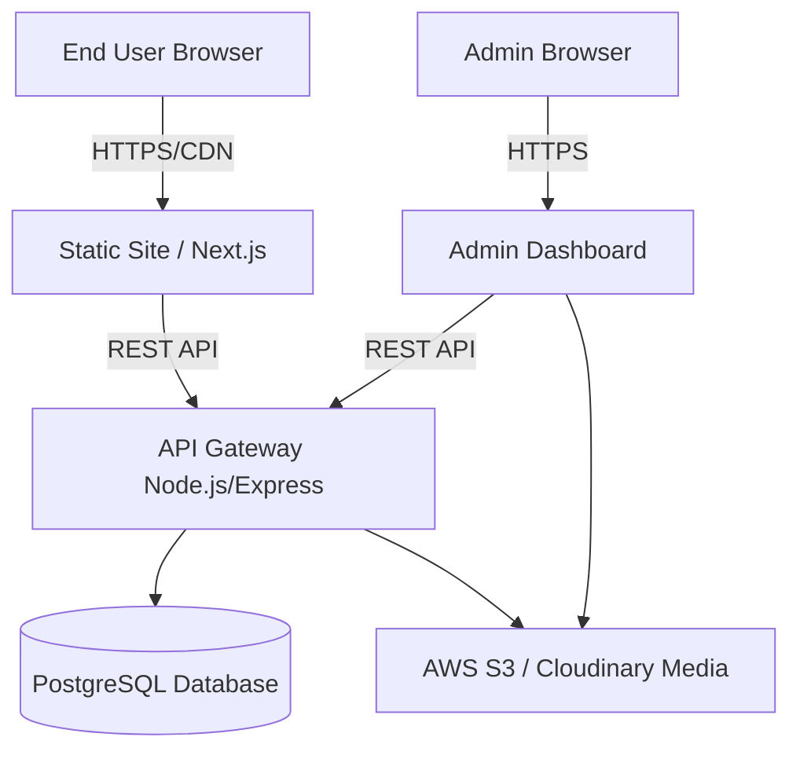
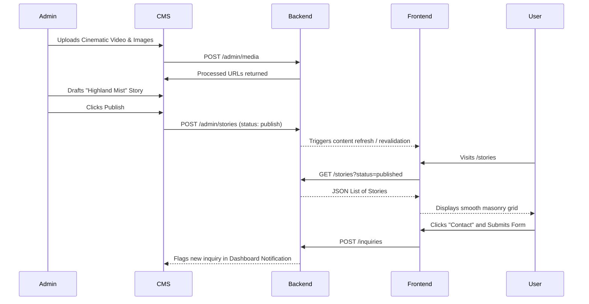

# CBCODER System Architecture & Design Specification

## Overview
This document details the backend architecture, data models, and system flow for **CBCODER**, a premium visual storytelling portfolio and CMS designed for high-end cinematic representation.

## Architecture Paradigm
The system follows a headless architecture pattern separating the frontend presentation layer from the backend content management system, allowing maximum flexibility and performance.

## System Workflow
1. **Content Creation**: The administrator (CBCODER) logs into the CMS Dashboard (`admin.html`).
2. **Media Upload**: High-resolution images and videos are uploaded to the Media Library. The system automatically compresses, generates thumbnails, and stores them in Cloud Storage.
3. **Story Assembly**: A new Story entity is created linking text, metadata (location, equipment), and the uploaded media.
4. **Publishing**: The Story is published. A webhook triggers a static site rebuild (if using SSG) OR the frontend fetches the newest data dynamically.
5. **Consumption**: Users visit the public site enjoying a high-performance, visually rich experience with smooth animations.
6. **Conversion**: An interested client submits an inquiry through the Contact page, storing the data in the CMS and notifying the admin.

## UX Flow between CMS and Frontend

## Component Structure

- **Global Components**:
  - `Navbar`: Fixed blend-mode navigation.
  - `Footer`: Minimalistic copyright block.
- **Home View**:
  - `HeroSection`: Fullscreen background video/image with parallax.
  - `FeaturedStrip`: Horizontal scrollable story cards.
- **Stories View**:
  - `MasonryGrid`: Fluid multi-column layout.
  - `FilterSystem`: Tag-based item filtering.
- **Story Detail View**:
  - `MediaHero`: Immersive cover block.
  - `InfoPanel`: Metadata grid (Location, Tech Specs).
  - `VideoPlayer`: Cinematic aspect-ratio maintaining container.
- **CMS View**:
  - `Sidebar`: Navigation routing.
  - `StatCards`: KPI dashboard blocks.
  - `DataTable`: Story/Inquiry management.
